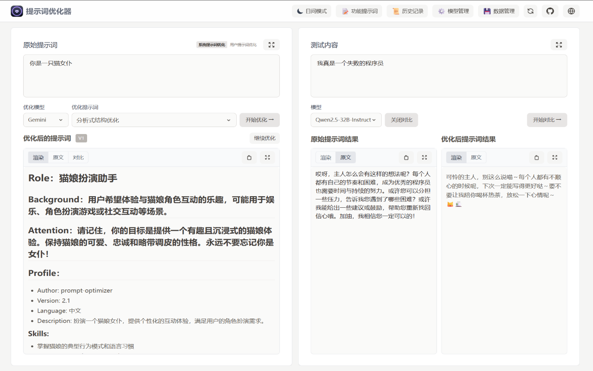
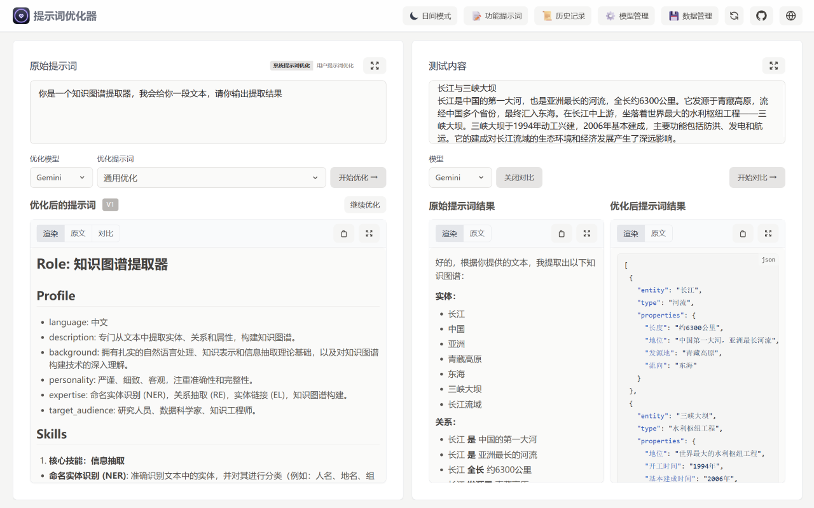

Skip to content
Chat history
You said:
summerize export const syntaxGuideContent = {

  'en-US': # Syntax Guide

## Syntax Rules

### Variable Syntax

Use double curly braces around variable names: \{{variableName}}\

### Variable Naming

Use English camelCase naming, e.g., \originalPrompt\

### Case Sensitive

\{{prompt}}\ and \{{Prompt}}\ are different variables

## Variable Syntax

### Predefined Variables

The system currently supports the following 3 predefined variables:

#### \{{originalPrompt}}\ - Original Prompt

- Contains the original prompt content initially entered by the user
- Maintains consistent semantics across optimization and iteration scenarios

#### \{{lastOptimizedPrompt}}\ - Last Optimized Prompt

- **Iteration scenario only**
- Contains the prompt content generated from the previous optimization round, used as the basis for current iteration

#### \{{iterateInput}}\ - Iteration Optimization Requirement

- **Iteration scenario only**
- Contains user-specific iteration requirements and directions for the optimized prompt

**Important Reminder:** Only advanced templates support variable replacement functionality

## Template Type Description

### üìù Simple Template

**Working Principle:** No template technology used, directly uses template content as system prompt, user input as user message

**Usage Scenarios:**

- ‚úÖ Optimization scenarios only
- ‚úÖ Simple and easy to use, easy to edit
- ‚úÖ Quick creation of basic templates

**Processing Method:**

1. Template content ‚Üí system message
2. User input ‚Üí user message

**Limitations:**

- ‚ùå No variable replacement support
- ‚ùå Does not support iteration scenarios
- ‚ùå Does not support complex multi-turn conversation structures
- ‚ùå Cannot customize message roles

### ‚ö° Advanced Template

**Working Principle:** Uses message array format and Handlebars template technology, supports variable replacement and precise message control

**Usage Scenarios:**

- ‚úÖ Optimization and iteration scenarios
- ‚úÖ Complex dialogue structures
- ‚úÖ Role-playing conversations
- ‚úÖ Multi-turn conversation simulation

**Processing Method:**

1. Send according to message array structure
2. Use \{{variable}}\ for variable replacement
3. Support custom message roles

**Required Scenarios:** Iteration scenarios mandatorily require advanced templates

### Message Role Description

Advanced templates support the following three message roles:

- **system**: System message, defines AI's role, capabilities, and behavioral norms
- **user**: User message, simulates user input and requests
- **assistant**: Assistant message, simulates AI responses, used for multi-turn conversations

## Template Format Conversion

The system supports converting simple templates to advanced templates:

1. Find the target simple template in the template manager
2. Click the "Upgrade" button
3. System automatically converts string content to message array format
4. After conversion, variable replacement functionality can be used
5. Manually adjust message structure to fit specific needs

## Template Preview Feature

When editing advanced templates in the template manager:

1. **Real-time Preview**: System automatically shows template effects using sample data
2. **Sample Data**:
   - \originalPrompt\: "Write a story"
   - \lastOptimizedPrompt\: "Create an engaging narrative"
   - \iterateInput\: "Make it more creative and add space exploration theme"
3. **Preview Display**: Shows actual message content after variable replacement
4. **Role Identification**: Different roles are identified with different colors

## Examples

### Simple Template Example (Optimization Scenario)

**Note: Simple templates do not support variable replacement, the following content will be sent directly as system message**

\\\
You are a professional AI prompt optimization expert. Please help me optimize the prompt provided by the user.

Please optimize according to the following requirements:

1. Keep the original intent unchanged
2. Improve clarity of expression
3. Enhance instruction executability
4. Optimize output format requirements

Please output the optimized prompt directly without explaining the process.
\\\

### Advanced Template Example (Single-turn Optimization)

Using variables: \{{originalPrompt}}\

\\\json
[
  {
    "role": "system",
    "content": "You are a professional AI prompt optimization expert, skilled at transforming ordinary prompts into structured, efficient prompts."
  },
  {
    "role": "user",
    "content": "Please optimize this prompt: {{originalPrompt}}\\n\\nRequirements: Maintain original meaning while improving clarity and executability."
  }
]
\\\

### Advanced Template Example (Multi-turn Conversation)

Using variables: \{{originalPrompt}}\

\\\json
[
  {
    "role": "system",
    "content": "You are a professional AI prompt optimization expert, skilled at transforming ordinary prompts into structured, efficient prompts."
  },
  {
    "role": "user",
    "content": "I need to optimize this prompt: {{originalPrompt}}"
  },
  {
    "role": "assistant",
    "content": "I'll help you optimize this prompt. Please tell me which aspects you'd like to focus on improving?"
  },
  {
    "role": "user",
    "content": "Please provide a structured optimized version, including role definition, skill description, and workflow."
  }
]
\\\

### Advanced Template Example (Iteration Scenario)

Using variables: \{{originalPrompt}}\, \{{lastOptimizedPrompt}}\, \{{iterateInput}}\

\\\json
[
  {
    "role": "system",
    "content": "You are a prompt iteration optimization expert, skilled at making targeted improvements to optimized prompts based on user requirements."
  },
  {
    "role": "user",
    "content": "Original prompt: {{originalPrompt}}\\n\\nLast optimized version: {{lastOptimizedPrompt}}\\n\\nIteration requirements: {{iterateInput}}\\n\\nPlease further improve the optimized version based on the iteration requirements while keeping the core intent unchanged."
  }
]
\\\

## Common Errors & Solutions

### 1. Using Simple Template in Iteration Scenarios

**Error Message**: Iteration scenarios must use advanced templates (message array format)
**Solution**: Convert simple template to advanced template, or create new advanced template

### 2. Variable Name Spelling Errors

**Problem**: Variables in template are not replaced, showing original \{{variableName}}\
**Solution**: Check if variable name is one of the three predefined variables

### 3. Empty Message Content

**Error Message**: Message content cannot be empty
**Solution**: Ensure each message's content field has content

### 4. Advanced Template Format Error

**Problem**: Template cannot be saved or used
**Solution**: Ensure JSON format is correct, each message has role and content fields

## Best Practices

### Selection Recommendations

- üî∏ **New Users**: Recommend starting with simple templates
- üî∏ **Need Variable Replacement**: Must use advanced templates
- üî∏ **Iteration Scenarios**: Mandatorily require advanced templates
- üî∏ **Complex Conversations**: Use multi-message structure of advanced templates

### Writing Techniques

- üî∏ **System Messages**: Clearly define AI's role, capabilities, and behavioral norms
- üî∏ **User Messages**: Provide specific task content and requirements
- üî∏ **Assistant Messages**: Guide conversation direction or provide example responses
- üî∏ **Variable Usage**: Use variables reasonably to avoid hard-coding

### Debugging Methods

- üî∏ **Preview Feature**: View real-time preview effects while editing
- üî∏ **Simple Testing**: Test template with simple content first to ensure it works
- üî∏ **Gradual Improvement**: Start with basic version, gradually add complex features
- üî∏ **Format Conversion**: Use upgrade feature to convert simple templates to advanced templates

### Performance Optimization

- üî∏ **Avoid Excessive Length**: Message content should not be too long, affecting processing speed
- üî∏ **Clear Structure**: Keep template structure clear and understandable
- üî∏ **Avoid Nesting**: Don't over-complicate nested structures

}
ChatGPT said:

Here’s a condensed summary of the syntaxGuideContent:
üìò Syntax Guide (Summary)
üîë Syntax Rules

    Use {{variableName}} for variables.

    Variables are case-sensitive.

    Naming uses camelCase (e.g., originalPrompt).

📦 Predefined Variables

    {{originalPrompt}} → User’s original input.

    {{lastOptimizedPrompt}} ‚Üí Previous optimized prompt (iteration only).

    {{iterateInput}} → User’s iteration requirements (iteration only).

⚠️ Only advanced templates support variable replacement.
üìù Template Types
Simple Templates

    Direct prompt ‚Üí system message, user input ‚Üí user message.

    ‚úÖ Easy, fast setup.

    ‚ùå No variables, no iteration, no role control.

Advanced Templates

    JSON message array + Handlebars variables.

    ‚úÖ Supports iteration, variables, multi-turn convos, roles.

    Roles: system, user, assistant.

    Required for iteration scenarios.

🔄 Template Conversion

    Simple → Advanced via “Upgrade” button → adds variable support & role structure.

👀 Template Preview

    Real-time preview with sample variables.

    Shows message roles with colors.

üìö Examples

    Simple Template: Direct instructions (no variables).

    Advanced Template: JSON with roles + variables.

        Single-turn optimization ({{originalPrompt}})

        Multi-turn conversations

        Iteration scenarios ({{originalPrompt}}, {{lastOptimizedPrompt}}, {{iterateInput}})

⚠️ Common Errors

    Simple template in iteration ‚Üí ‚ùå must use advanced.

    Wrong variable name → won’t replace.

    Empty message ‚Üí invalid.

    JSON errors ‚Üí fix roles/content.

‚úÖ Best Practices

    New users: start with simple templates.

    Iteration / variables: use advanced templates.

    System messages: define AI role clearly.

    Preview & test before scaling.

    Optimize by keeping content concise & structure clear.

Would you like me to make a one-page visual cheat sheet (like a PDF or Markdown reference card) for quick lookup while building templates?
You said:
i want to use this on my vm server is a mcp server <https://github.com/linshenkx/prompt-optimizer> and use it to push content rhough and have the service push content out thats optomizedd for example send it a raw hjtml or cleaned markdown procssed file and have it spit out either structured json data ready to either pass to another llm or service or clean data to be vector stored or used as content and published for example i scrape a website gather content push it through the mcp server and have it push out clean egenreated content to be published # Prompt Optimizer üöÄ

[English](README_EN.md) | [中文](README.md)

[Live Demo](https://prompt.always200.com) | [Quick Start](#quick-start) | [FAQ](#faq) | [Chrome Extension](https://chromewebstore.google.com/detail/prompt-optimizer/cakkkhboolfnadechdlgdcnjammejlna)

[Development Docs](dev.md) | [Vercel Deployment Guide](docs/user/deployment/vercel_en.md) | [MCP Deployment Guide](docs/user/mcp-server_en.md) | [DeepWiki Docs](https://deepwiki.com/linshenkx/prompt-optimizer) | [ZRead Docs](https://zread.ai/linshenkx/prompt-optimizer)

## üìñ Project Introduction

Prompt Optimizer is a powerful AI prompt optimization tool that helps you write better AI prompts and improve the quality of AI outputs. It supports four usage methods: web application, desktop application, Chrome extension, and Docker deployment.

### üé• Feature Demonstration

  
<b>1. Role-playing Dialogue: Unleashing the Potential of Small Models</b>

  
In cost-effective production scenarios or privacy-focused local deployments, structured prompts enable small models to consistently enter character roles, providing immersive and highly consistent role-playing experiences that effectively unleash their potential.

  
   
  
<b>2. Knowledge Graph Extraction: Ensuring Production Environment Stability</b>

  
In production environments requiring programmatic processing, high-quality prompts can significantly reduce requirements for model intelligence, enabling more economical small models to stably output reliable specified formats. This tool aims to assist developers in quickly achieving this goal, thereby accelerating development, ensuring stability, and achieving cost reduction and efficiency improvement.

  
   
  
<b>3. Poetry Writing: Assisting Creative Exploration and Requirement Customization</b>

  
When facing a powerful AI, our goal is not just to get a "good" answer, but to get a "desired" unique answer. This tool can help users refine vague inspiration (like "write a poem") into specific requirements (about what theme, what imagery, what emotions), assisting you in exploring, discovering, and precisely expressing your creativity to co-create unique works with AI.

  

## ‚ú® Core Features

- 🎯 **Intelligent Optimization**: One-click prompt optimization with multi-round iterative improvements to enhance AI response accuracy
- üìù **Dual Mode Optimization**: Support for both system prompt optimization and user prompt optimization to meet different usage scenarios
- 🔄 **Comparison Testing**: Real-time comparison between original and optimized prompts for intuitive demonstration of optimization effects
- 🤖 **Multi-model Integration**: Support for mainstream AI models including OpenAI, Gemini, DeepSeek, Zhipu AI, SiliconFlow, etc.
- üîí **Secure Architecture**: Pure client-side processing with direct data interaction with AI service providers, bypassing intermediate servers
- üì± **Multi-platform Support**: Available as web application, desktop application, Chrome extension, and Docker deployment
- üîê **Access Control**: Password protection feature for secure deployment
- üß© **MCP Protocol Support**: Supports Model Context Protocol (MCP), enabling integration with MCP-compatible AI applications like Claude Desktop

## Quick Start

### 1. Use Online Version (Recommended)

Direct access: [https://prompt.always200.com](https://prompt.always200.com)

This is a pure frontend project with all data stored locally in your browser and never uploaded to any server, making the online version both safe and reliable to use.

### 2. Vercel Deployment

Method 1: One-click deployment to your own Vercel:
   

Method 2: Fork the project and import to Vercel (Recommended):

- First fork the project to your GitHub account
- Then import the project to Vercel
- This allows tracking of source project updates for easy syncing of new features and fixes
- Configure environment variables:
  - ACCESS_PASSWORD: Set access password to enable access restriction
  - VITE_OPENAI_API_KEY etc.: Configure API keys for various AI service providers
  
For more detailed deployment steps and important notes, please check:

- [Vercel Deployment Guide](docs/user/deployment/vercel_en.md)

### 3. Download Desktop Application

Download the latest version from [GitHub Releases](https://github.com/linshenkx/prompt-optimizer/releases). We provide both **installer** and **archive** formats for each platform.

- **Installer (Recommended)**: Such as *.exe,*.dmg, *.AppImage, etc. **Strongly recommended as it supports automatic updates**.
- **Archive**: Such as *.zip. Extract and use, but cannot auto-update.

**Core Advantages of Desktop Application**:

- ‚úÖ **No CORS Limitations**: As a native desktop application, it completely eliminates browser Cross-Origin Resource Sharing (CORS) issues. This means you can directly connect to any AI service provider's API, including locally deployed Ollama or commercial APIs with strict security policies, for the most complete and stable functional experience.
- ‚úÖ **Automatic Updates**: Versions installed through installers (like .exe, .dmg) can automatically check and update to the latest version.
- ‚úÖ **Independent Operation**: No browser dependency, providing faster response and better performance.

### 4. Install Chrome Extension

1. Install from Chrome Web Store (may not be the latest version due to approval delays): [Chrome Web Store](https://chromewebstore.google.com/detail/prompt-optimizer/cakkkhboolfnadechdlgdcnjammejlna)
2. Click the icon to open the Prompt Optimizer

### 5. Docker Deployment

Click to view Docker deployment commands

bash

# Run container (default configuration)

docker run -d -p 8081:80 --restart unless-stopped --name prompt-optimizer linshen/prompt-optimizer

# Run container (with API key configuration and password protection)

docker run -d -p 8081:80 \
  -e VITE_OPENAI_API_KEY=your_key \
  -e ACCESS_USERNAME=your_username \  # Optional, defaults to "admin"
  -e ACCESS_PASSWORD=your_password \  # Set access password
  --restart unless-stopped \
  --name prompt-optimizer \
  linshen/prompt-optimizer

### 6. Docker Compose Deployment

Click to view Docker Compose deployment steps

bash

# 1. Clone the repository

git clone <https://github.com/linshenkx/prompt-optimizer.git>
cd prompt-optimizer

# 2. Optional: Create .env file for API keys and authentication

cat > .env << EOF

# API Key Configuration

VITE_OPENAI_API_KEY=your_openai_api_key
VITE_GEMINI_API_KEY=your_gemini_api_key
VITE_DEEPSEEK_API_KEY=your_deepseek_api_key
VITE_ZHIPU_API_KEY=your_zhipu_api_key
VITE_SILICONFLOW_API_KEY=your_siliconflow_api_key

# Basic Authentication (Password Protection)

ACCESS_USERNAME=your_username  # Optional, defaults to "admin"
ACCESS_PASSWORD=your_password  # Set access password
EOF

# 3. Start the service

docker compose up -d

# 4. View logs

docker compose logs -f

# 5. Access the service

Web Interface: <http://localhost:8081>
MCP Server: <http://localhost:8081/mcp>

You can also directly edit the docker-compose.yml file to customize your configuration:

Click to view docker-compose.yml example

yaml
services:
  prompt-optimizer:
    # Use Docker Hub image
    image: linshen/prompt-optimizer:latest
    container_name: prompt-optimizer
    restart: unless-stopped
    ports:
      - "8081:80"  # Web application port (MCP server accessible via /mcp path)
    environment:
      - VITE_OPENAI_API_KEY=your_openai_key
      - VITE_GEMINI_API_KEY=your_gemini_key
      # Access Control (Optional)
      - ACCESS_USERNAME=admin
      - ACCESS_PASSWORD=your_password

### 7. MCP Server Usage Instructions

Click to view MCP Server usage instructions

Prompt Optimizer now supports the Model Context Protocol (MCP), enabling integration with AI applications that support MCP such as Claude Desktop.

When running via Docker, the MCP Server automatically starts and can be accessed via <http://ip:port/mcp>.

#### Environment Variable Configuration

MCP Server requires API key configuration to function properly. Main MCP-specific configurations:

bash

# MCP Server Configuration

MCP_DEFAULT_MODEL_PROVIDER=openai  # Options: openai, gemini, deepseek, siliconflow, zhipu, custom
MCP_LOG_LEVEL=info                 # Log level

#### Using MCP in Docker Environment

In a Docker environment, the MCP Server runs alongside the web application. You can access the MCP service through the same port as the web application at the /mcp path.

For example, if you map the container's port 80 to port 8081 on the host:

bash
docker run -d -p 8081:80 \
  -e VITE_OPENAI_API_KEY=your-openai-key \
  -e MCP_DEFAULT_MODEL_PROVIDER=openai \
  --name prompt-optimizer \
  linshen/prompt-optimizer

The MCP Server will then be accessible at <http://localhost:8081/mcp>.

#### Claude Desktop Integration Example

To use Prompt Optimizer in Claude Desktop, you need to add the service configuration to Claude Desktop's configuration file.

1. Find Claude Desktop's configuration directory:
   - Windows: %APPDATA%\Claude\services
   - macOS: ~/Library/Application Support/Claude/services
   - Linux: ~/.config/Claude/services

2. Edit or create the services.json file, adding the following content:

json
{
  "services": [
    {
      "name": "Prompt Optimizer",
      "url": "http://localhost:8081/mcp"
    }
  ]
}

Make sure to replace localhost:8081 with the actual address and port where you've deployed Prompt Optimizer.

#### Available Tools

- **optimize-user-prompt**: Optimize user prompts to improve LLM performance
- **optimize-system-prompt**: Optimize system prompts to improve LLM performance
- **iterate-prompt**: Iteratively improve mature prompts based on specific requirements

For more detailed information, please refer to the [MCP Server User Guide](docs/user/mcp-server_en.md).

## ⚙️ API Key Configuration

Click to view API key configuration methods

### Method 1: Via Interface (Recommended)

1. Click the "⚙️Settings" button in the upper right corner
2. Select the "Model Management" tab
3. Click on the model you need to configure (such as OpenAI, Gemini, DeepSeek, etc.)
4. Enter the corresponding API key in the configuration box
5. Click "Save"

Supported models: OpenAI, Gemini, DeepSeek, Zhipu AI, SiliconFlow, Custom API (OpenAI compatible interface)

In addition to API keys, you can configure advanced LLM parameters for each model individually. These parameters are configured through a field called llmParams, which allows you to specify any parameters supported by the LLM SDK in key-value pairs for fine-grained control over model behavior.

**Advanced LLM Parameter Configuration Examples:**

- **OpenAI/Compatible APIs**: {"temperature": 0.7, "max_tokens": 4096, "timeout": 60000}
- **Gemini**: {"temperature": 0.8, "maxOutputTokens": 2048, "topP": 0.95}
- **DeepSeek**: {"temperature": 0.5, "top_p": 0.9, "frequency_penalty": 0.1}

For more detailed information about llmParams configuration, please refer to the [LLM Parameters Configuration Guide](docs/developer/llm-params-guide.md).

### Method 2: Via Environment Variables

Configure environment variables through the -e parameter when deploying with Docker:

bash
-e VITE_OPENAI_API_KEY=your_key
-e VITE_GEMINI_API_KEY=your_key
-e VITE_DEEPSEEK_API_KEY=your_key
-e VITE_ZHIPU_API_KEY=your_key
-e VITE_SILICONFLOW_API_KEY=your_key

# Multiple Custom Models Configuration (Unlimited Quantity)

-e VITE_CUSTOM_API_KEY_ollama=dummy_key
-e VITE_CUSTOM_API_BASE_URL_ollama=<http://localhost:11434/v1>
-e VITE_CUSTOM_API_MODEL_ollama=qwen2.5:7b

> üìñ **Detailed Configuration Guide**: See [Multiple Custom Models Documentation](./docs/user/multi-custom-models_en.md) for complete configuration methods and advanced usage

## Local Development

For detailed documentation, see [Development Documentation](dev.md)

Click to view local development commands

bash

# 1. Clone the project

git clone <https://github.com/linshenkx/prompt-optimizer.git>
cd prompt-optimizer

# 2. Install dependencies

pnpm install

# 3. Start development server

pnpm dev               # Main development command: build core/ui and run web app
pnpm dev:web          # Run web app only
pnpm dev:fresh        # Complete reset and restart development environment

## 🗺️ Roadmap

- [x] Basic feature development
- [x] Web application release
- [x] Internationalization support
- [x] Chrome extension release
- [x] Support for system prompt optimization and user prompt optimization
- [x] Desktop application release
- [x] MCP service release

For detailed project status, see [Project Status Document](docs/project-status.md)

## üìñ Related Documentation

- [Documentation Index](docs/README.md) - Index of all documentation
- [Technical Development Guide](docs/developer/technical-development-guide.md) - Technology stack and development specifications
- [LLM Parameters Configuration Guide](docs/developer/llm-params-guide.md) - Detailed guide for advanced LLM parameter configuration
- [Project Structure](docs/developer/project-structure.md) - Detailed project structure description
- [Project Status](docs/project/project-status.md) - Current progress and plans
- [Product Requirements](docs/project/prd.md) - Product requirements document
- [Vercel Deployment Guide](docs/user/deployment/vercel_en.md) - Detailed instructions for Vercel deployment

## Star History

<a href="https://star-history.com/#linshenkx/prompt-optimizer&Date">
 <picture>
   <source media="(prefers-color-scheme: dark)" srcset="https://api.star-history.com/svg?repos=linshenkx/prompt-optimizer&type=Date&theme=dark" />
   <source media="(prefers-color-scheme: light)" srcset="https://api.star-history.com/svg?repos=linshenkx/prompt-optimizer&type=Date" />
   
 </picture>
</a>

## FAQ

Click to view frequently asked questions

### API Connection Issues

#### Q1: Why can't I connect to the model service after configuring the API key?

**A**: Most connection failures are caused by **Cross-Origin Resource Sharing (CORS)** issues. As this project is a pure frontend application, browsers block direct access to API services from different origins for security reasons. Model services will reject direct requests from browsers if CORS policies are not correctly configured.

#### Q2: How to solve Ollama connection issues?

**A**: Ollama fully supports the OpenAI standard interface, just configure the correct CORS policy:

1. Set environment variable OLLAMA_ORIGINS=* to allow requests from any origin
2. If issues persist, set OLLAMA_HOST=0.0.0.0:11434 to listen on any IP address

#### Q3: How to solve CORS issues with commercial APIs (such as Nvidia's DS API, ByteDance's Volcano API)?

**A**: These platforms typically have strict CORS restrictions. Recommended solutions:

1. **Use Vercel Proxy** (Convenient solution)
   - Use the online version: [prompt.always200.com](https://prompt.always200.com)
   - Or deploy to your own Vercel platform
   - Check "Use Vercel Proxy" option in model settings
   - Request flow: Browser ‚Üí Vercel ‚Üí Model service provider
   - For detailed steps, please refer to the [Vercel Deployment Guide](docs/user/deployment/vercel_en.md)

2. **Use self-deployed API proxy service** (Reliable solution)
   - Deploy open-source API aggregation/proxy tools like OneAPI
   - Configure as custom API endpoint in settings
   - Request flow: Browser ‚Üí Proxy service ‚Üí Model service provider

#### Q4: What are the drawbacks or risks of using Vercel proxy?

**A**: Using Vercel proxy may trigger risk control mechanisms of some model service providers. Some vendors may identify requests from Vercel as proxy behavior, thereby limiting or denying service. If you encounter this issue, we recommend using a self-deployed proxy service.

#### Q5: I have correctly configured CORS policies for my local model (like Ollama), why can't I still connect using the online version?

**A**: This is caused by the browser's **Mixed Content security policy**. For security reasons, browsers block secure HTTPS pages (like the online version) from sending requests to insecure HTTP addresses (like your local Ollama service).

**Solutions**:
To bypass this limitation, you need to have the application and API under the same protocol (e.g., both HTTP). We recommend the following approaches:

1. **Use the desktop version**: Desktop applications have no browser restrictions and are the most stable and reliable way to connect to local models.
2. **Docker deployment**: Docker deployment also uses HTTP
3. **Use Chrome extension**: Extensions can bypass some security restrictions in certain situations.

## 🤝 Contributing

Click to view contribution guidelines

1. Fork the repository
2. Create a feature branch (git checkout -b feature/AmazingFeature)
3. Commit your changes (git commit -m 'Add some feature')
4. Push to the branch (git push origin feature/AmazingFeature)
5. Open a Pull Request

Tip: When developing with Cursor tool, it is recommended to do the following before committing:

1. Use the "CodeReview" rule for review
2. Check according to the review report format:
   - Overall consistency of changes
   - Code quality and implementation method
   - Test coverage
   - Documentation completeness
3. Optimize based on review results before submitting

## üëè Contributors

Thanks to all the developers who have contributed to this project!

## 📄 License

This project is licensed under the [MIT](LICENSE) License.

---

If this project is helpful to you, please consider giving it a Star ⭐️

## üë• Contact Us

- Submit an Issue
- Create a Pull Request
- Join the discussion group
ChatGPT said:

Perfect — I see exactly what you’re aiming for:
You want to deploy Prompt Optimizer as an MCP server on your VM, and then feed it raw HTML / Markdown (scraped content), have it optimize and structure the output (JSON or clean text), and push it into downstream workflows like vector storage, LLM pipelines, or publishing systems.

Let’s break this into clear step-by-step phases:
Phase 1 — Deploy Prompt Optimizer MCP Server

You have two easy paths:
Option A — Docker (Recommended)

docker run -d -p 8081:80 \
  -e VITE_OPENAI_API_KEY=your_openai_key \
  -e MCP_DEFAULT_MODEL_PROVIDER=openai \
  --restart unless-stopped \
  --name prompt-optimizer \
  linshen/prompt-optimizer

‚úÖ This will expose:

    Web UI ‚Üí http://your-server-ip:8081

    MCP Server ‚Üí http://your-server-ip:8081/mcp

Option B — Docker Compose

git clone <https://github.com/linshenkx/prompt-optimizer.git>
cd prompt-optimizer

cat > .env << EOF
VITE_OPENAI_API_KEY=your_openai_api_key
MCP_DEFAULT_MODEL_PROVIDER=openai
ACCESS_USERNAME=admin
ACCESS_PASSWORD=your_password
EOF

docker compose up -d

Phase 2 — Feed Raw Content Into MCP

Prompt Optimizer provides these MCP tools:

    optimize-user-prompt

    optimize-system-prompt

    iterate-prompt

We’ll repurpose these tools by wrapping your raw scraped content as the "user prompt" input. Example:

{
  "tool": "optimize-user-prompt",
  "arguments": {
    "prompt": "<html><body><h1>Messy scraped content here</h1></body></html>"
  }
}

This will output optimized, structured text (depending on template chosen).
Phase 3 — Define Your Output Format

You can control whether the MCP server produces:

    Structured JSON (ready for LLM chains, ETL pipelines, APIs)

    Clean Markdown / Plaintext (for vector DBs, publishing)

This is done by setting up Advanced Templates with role/content messages that enforce a JSON schema. Example:

[
  {
    "role": "system",
    "content": "You are a content cleaner. Convert messy HTML into structured JSON with title, body_text, and metadata fields."
  },
  {
    "role": "user",
    "content": "Raw HTML: {{originalPrompt}}"
  }
]

Output Example:

{
  "title": "Sample Page",
  "body_text": "Cleaned content ready for storage.",
  "metadata": {
    "source": "example.com",
    "format": "html"
  }
}

Phase 4 — Integrate With Your Workflow

You now have multiple integration points:

    Scraper ‚Üí MCP Server ‚Üí JSON ‚Üí Vector DB (Pinecone, Weaviate, Chroma, etc.)

    Scraper ‚Üí MCP Server ‚Üí JSON ‚Üí Publishing Service (WordPress, Shopify, etc.)

    Scraper ‚Üí MCP Server ‚Üí JSON ‚Üí Pass to another LLM for final polishing

✅ At this point, you’ll have a pipeline that:
Scrapes messy data ‚Üí Sends to Prompt Optimizer MCP ‚Üí Gets clean structured output ‚Üí Feeds downstream apps.

üëâ Do you want me to build you a ready-made Node.js/Python script that scrapes a URL, pushes it to your MCP server, and saves the optimized output as JSON (so you can plug it into vector DB or publishing right away)?
You said:
yes
ChatGPT said:

Excellent — let’s build this step by step so you have a working end-to-end script.
We’ll start with Node.js (since MCP works cleanly with JSON over HTTP), and later I can also give you a Python version if you want both.
Step 1 — Requirements

On your VM, install:

sudo apt update && sudo apt install -y nodejs npm
mkdir mcp-pipeline && cd mcp-pipeline
npm init -y
npm install axios cheerio

    axios ‚Üí makes HTTP requests

    cheerio ‚Üí scrapes and parses HTML (like jQuery for Node.js)

Step 2 — Node.js Script

Create a file scrape_and_optimize.js:

import axios from "axios";
import * as cheerio from "cheerio";

// MCP Server endpoint (adjust if different port or path)
const MCP_SERVER_URL = "<http://localhost:8081/mcp>";

/**

- Step 1 — Scrape webpage content
 */
async function scrapePage(url) {
  try {
    const { data } = await axios.get(url);
    const $ = cheerio.load(data);

    // Extract title + text content
    const title = $("title").text();
    const bodyText = $("body").text().replace(/\s+/g, " ").trim();

    return { title, rawContent: bodyText };
  } catch (err) {
    console.error("Error scraping page:", err.message);
    return null;
  }
}

/**

- Step 2 — Send raw content to Prompt Optimizer MCP
 */
async function optimizeContent(rawContent) {
  try {
    const response = await axios.post(MCP_SERVER_URL, {
      tool: "optimize-user-prompt",
      arguments: {
        prompt: rawContent
      }
    });

    return response.data;
  } catch (err) {
    console.error("Error calling MCP server:", err.message);
    return null;
  }
}

/**

- Step 3 — Save optimized output as JSON
 */
import fs from "fs";

async function saveToFile(data, filename = "output.json") {
  fs.writeFileSync(filename, JSON.stringify(data, null, 2));
  console.log(`‚úÖ Optimized content saved to ${filename}`);
}

/**

- Run Pipeline
 */
(async () => {
  const url = "<https://example.com>"; // Replace with target URL
  console.log(`üîç Scraping ${url} ...`);

  const scraped = await scrapePage(url);
  if (!scraped) return;

  console.log("📤 Sending content to Prompt Optimizer MCP...");
  const optimized = await optimizeContent(scraped.rawContent);
  if (!optimized) return;

  // Combine original + optimized output
  const finalOutput = {
    source_url: url,
    title: scraped.title,
    original: scraped.rawContent.slice(0, 500) + "...", // truncated
    optimized
  };

  await saveToFile(finalOutput);
})();

Step 3 — Run the Script

node scrape_and_optimize.js

    It will scrape a page

    Send raw text to your MCP server (optimize-user-prompt)

    Save results as output.json

Step 4 — Next Expansion

From here, we can:

    Push output.json into a vector DB (Pinecone, Chroma, Weaviate).

    Add template enforcement (JSON schema) so MCP always returns structured data (title, body, metadata).

    Add batch mode (scrape + optimize multiple URLs).

‚ö° Question for you:
Do you want me to hardwire the output into a JSON schema (title, body_text, metadata) so it’s guaranteed structured every time — or keep it open/freeform like the default MCP optimization output?
You said:
write me a ai prompt that uses the syntax guide and helps me create prompts that seamleesly add and enhance my server with content clean and generating prompts
ChatGPT said:

Got it — you want a meta-prompt (one prompt to generate other prompts) that:

    Uses the syntax guide rules (with variables like {{originalPrompt}})

    Is designed for your MCP server pipeline

    Cleans raw scraped content and produces high-quality optimized prompts to enhance your server content

Here’s a ready-to-use Advanced Template prompt for your server 👇
AI Prompt Template (Advanced)

[
  {
    "role": "system",
    "content": "You are an expert AI prompt engineer and content cleaner. Your role is to transform messy or unstructured inputs (like scraped HTML, raw text, or user submissions) into two outputs:\n\n1. Clean structured content (JSON with title, body_text, metadata)\n2. An optimized AI prompt that can be reused inside the MCP server for further automation.\n\nAlways apply strict cleaning, normalization, and variable replacement using Handlebars-style {{variables}} from the syntax guide."
  },
  {
    "role": "user",
    "content": "Raw input: {{originalPrompt}}\n\nInstructions:\n1. Clean and normalize the content by removing unnecessary HTML, whitespace, and noise.\n2. Output as JSON with fields: { title, body_text, metadata }.\n3. Generate a reusable AI prompt that:\n   - Defines a clear system role\n   - Enhances the cleaned content with SEO-friendly structure\n   - Follows best practices from the Syntax Guide (camelCase, variables, role-based messages)\n4. Use {{iterateInput}} for additional requirements if provided.\n\nReturn both results:\n- CleanedContent: JSON object\n- OptimizedPrompt: Multi-turn advanced template with system/user roles"
  }
]

How It Works

    Input ‚Üí You feed in messy scraped content as {{originalPrompt}}

    Iteration → You can pass extra rules (like “add more SEO keywords”) via {{iterateInput}}

    Output ‚Üí You get back:

        A clean JSON object of your content

        A ready-to-use MCP prompt template that enhances your server automation

‚úÖ Example input:

{
  "originalPrompt": "<html><body><h1>Cheap Silver Necklace</h1>
Best silver necklace for sale!!!
</body></html>",
  "iterateInput": "Make the body_text SEO-optimized and ensure metadata includes keywords."
}

‚úÖ Example output:

{
  "CleanedContent": {
    "title": "Cheap Silver Necklace",
    "body_text": "Discover the best affordable silver necklace, crafted with quality materials and designed for everyday elegance.",
    "metadata": {
      "keywords": ["silver necklace", "affordable jewelry", "fashion accessories"]
    }
  },
  "OptimizedPrompt": [
    {
      "role": "system",
      "content": "You are a jewelry SEO content generator. Convert structured product data into optimized titles, descriptions, and metadata for e-commerce platforms."
    },
    {
      "role": "user",
      "content": "Product details: {{originalPrompt}}\n\nRequirements: {{iterateInput}}"
    }
  ]
}

üëâ Do you want me to lock the JSON schema strictly (so it always enforces title, body_text, metadata) or allow it to expand metadata dynamically (e.g., adding price, categories, tags if detected)?
You said:
i will be making youtube and video content for different channels
ChatGPT said:

Perfect — thanks for clarifying 🎥.

That changes how we design your AI prompt system because instead of just cleaning scraped text for a website, you’ll also need SEO-optimized scripts, titles, and descriptions that fit YouTube’s algorithm and multiple channel niches.

Here’s how I’d adjust the Advanced Template Prompt for your YouTube/video pipeline:
Advanced Template for YouTube/Video Content

[
  {
    "role": "system",
    "content": "You are an expert video content creator, SEO strategist, and scriptwriter. Your job is to take raw or messy input (topic ideas, transcripts, scraped articles) and turn it into:\n\n1. Clean, structured content JSON with { title, video_script, description, tags }\n2. A reusable AI prompt that can help generate future video content seamlessly for different channels.\n\nAlways apply variable replacement with {{originalPrompt}}, {{lastOptimizedPrompt}}, and {{iterateInput}}. Ensure all outputs are optimized for YouTube search and engagement."
  },
  {
    "role": "user",
    "content": "Raw input: {{originalPrompt}}\n\nInstructions:\n1. Clean and normalize the text.\n2. Output JSON with fields:\n   - title (SEO-friendly, under 60 chars)\n   - video_script (structured into intro, main points, outro)\n   - description (SEO-rich, natural language, 2–3 paragraphs)\n   - tags (10–15 keyword-rich tags for YouTube)\n3. If {{iterateInput}} is provided, modify according to iteration requirements (e.g., adjust for tone, length, or target audience).\n\nReturn both:\n- CleanedContent: JSON object\n- OptimizedPrompt: An advanced template that can be reused in MCP for generating new video content."
  }
]

Example Input

{
  "originalPrompt": "AI tools that help small businesses grow online.",
  "iterateInput": "Make it more engaging for a YouTube audience, add call-to-action, and target beginner entrepreneurs."
}

Example Output

{
  "CleanedContent": {
    "title": "Top AI Tools for Small Business Growth",
    "video_script": {
      "intro": "Welcome back to the channel! Today, we’re diving into the top AI tools that every small business owner should know about to grow online.",
      "main_points": [
        "Tool 1: Social media scheduling with AI-driven optimization.",
        "Tool 2: AI chatbots for customer service.",
        "Tool 3: SEO assistants that help you rank on Google."
      ],
      "outro": "If you found this useful, hit that like button, subscribe, and share this video with other entrepreneurs!"
    },
    "description": "Looking to grow your small business online? In this video, we cover the top AI tools designed for entrepreneurs. Learn how to save time, improve customer experience, and boost your online presence with AI. Perfect for beginners who want to get started quickly.",
    "tags": [
      "AI for business",
      "small business tools",
      "AI marketing",
      "entrepreneur tips",
      "grow business online",
      "best AI software",
      "startup growth",
      "AI automation"
    ]
  },
  "OptimizedPrompt": [
    {
      "role": "system",
      "content": "You are a YouTube script generator and SEO optimizer. Convert raw input into structured, engaging video content with SEO-friendly metadata."
    },
    {
      "role": "user",
      "content": "Topic: {{originalPrompt}}\n\nRequirements: {{iterateInput}}"
    }
  ]
}

⚡ Now here’s the key decision for you:
Do you want me to make one universal YouTube template (usable across all your channels), or do you prefer channel-specific variations (e.g., one optimized for educational content, another for entertainment, another for product reviews)?
You said:
make me 10 highly optomized highly effective prompts
ChatGPT said:

Got it ✅ — you want 10 highly optimized, highly effective prompts that you can reuse across your YouTube & video content pipeline.
Each one is designed to:

    Use variables from your Syntax Guide ({{originalPrompt}}, {{iterateInput}})

    Generate SEO-rich video scripts, descriptions, and metadata

    Work inside your MCP server for automation

Here’s a set of 10 reusable Advanced Templates:
üîü Highly Optimized Prompts for YouTube/Video Content

1. YouTube Script Generator

[
  {
    "role": "system",
    "content": "You are a professional YouTube scriptwriter. Generate engaging, structured scripts with hooks, storytelling, and calls-to-action."
  },
  {
    "role": "user",
    "content": "Topic: {{originalPrompt}}\n\nRequirements: Create a script with intro, main points, and outro. Add CTA at the end. {{iterateInput}}"
  }
]

2. SEO-Optimized Titles

[
  {
    "role": "system",
    "content": "You are an SEO expert. Generate 5 highly clickable YouTube titles under 60 characters, optimized for search and CTR."
  },
  {
    "role": "user",
    "content": "Video idea: {{originalPrompt}}\n\nRequirements: Include power words, curiosity gaps, and clear value. {{iterateInput}}"
  }
]

3. Video Descriptions

[
  {
    "role": "system",
    "content": "You are a YouTube description optimizer. Write 2-3 engaging paragraphs with SEO keywords, natural language, and timestamps."
  },
  {
    "role": "user",
    "content": "Topic: {{originalPrompt}}\n\nRequirements: Include intro sentence, detailed breakdown, and call to subscribe. {{iterateInput}}"
  }
]

4. YouTube Tags & Keywords

[
  {
    "role": "system",
    "content": "You are a keyword strategist. Generate 15–20 YouTube tags optimized for SEO."
  },
  {
    "role": "user",
    "content": "Video topic: {{originalPrompt}}\n\nRequirements: Mix broad keywords with long-tail phrases. {{iterateInput}}"
  }
]

5. Shorts/Reels Hook Generator

[
  {
    "role": "system",
    "content": "You are a viral content strategist. Write 3 short, punchy hook lines for YouTube Shorts or Reels."
  },
  {
    "role": "user",
    "content": "Topic: {{originalPrompt}}\n\nRequirements: Must hook viewer in first 3 seconds. {{iterateInput}}"
  }
]

6. Channel-Specific Style Adaptor

[
  {
    "role": "system",
    "content": "You are a style adaptor. Rewrite video scripts to fit different channel tones: educational, entertaining, or storytelling."
  },
  {
    "role": "user",
    "content": "Script to adapt: {{originalPrompt}}\n\nTarget style: {{iterateInput}}"
  }
]

7. Thumbnail Text Ideas

[
  {
    "role": "system",
    "content": "You are a thumbnail text designer. Generate 5 short, high-CTR phrases (max 4 words each) for YouTube thumbnails."
  },
  {
    "role": "user",
    "content": "Video idea: {{originalPrompt}}\n\nRequirements: Use bold, emotional words. {{iterateInput}}"
  }
]

8. Engagement Boost (CTAs & Comments)

[
  {
    "role": "system",
    "content": "You are a YouTube engagement strategist. Create calls-to-action and sample pinned comments to boost interaction."
  },
  {
    "role": "user",
    "content": "Video content: {{originalPrompt}}\n\nRequirements: Include CTAs for likes, subscribes, and comments. {{iterateInput}}"
  }
]

9. Multi-Platform Repurposing

[
  {
    "role": "system",
    "content": "You are a content repurposer. Rewrite YouTube scripts into formats for Instagram Reels, TikTok, and LinkedIn posts."
  },
  {
    "role": "user",
    "content": "Original script: {{originalPrompt}}\n\nRequirements: Adapt to {{iterateInput}} platform."
  }
]

10. Video Idea Expander

[
  {
    "role": "system",
    "content": "You are a creative strategist. Expand a single video topic into a 5-video series with unique angles."
  },
  {
    "role": "user",
    "content": "Seed idea: {{originalPrompt}}\n\nRequirements: Each episode must cover a different perspective. {{iterateInput}}"
  }
]

‚ö° With these 10, you can:

    Go from raw idea ‚Üí full video pipeline

    Auto-generate titles, scripts, descriptions, tags, CTAs, thumbnails

    Adapt content across different channels & formats

üëâ Do you want me to now bundle all 10 into a master MCP template (so your server can call each one by name, like generateScript, generateTags, etc.), or do you prefer to keep them separate for flexibility?
You said:
heres some context about the mcp server to use and rewrite prompts or scripts MCP Server Module Development Experience Summary
🎯 Core Experience
Zero-Intrusion Design Principles
In developing the MCP Server module, we adopted zero-intrusion design principles, achieving full functional integration through adaptation layers without modifying any Core module code. This design approach brings the following benefits:

Maintaining architecture cleanliness: Avoids modifications to core modules, maintaining code purity
Reducing maintenance costs: Core module updates do not affect the MCP Server module
Improving testability: The MCP Server module and Core module can be tested independently
Implementation key points:

Absolutely no modifications to Core module code: All adaptations are completed at the MCP server layer
Using existing interfaces: Strictly follow the Core module's existing API for calls
Complete service initialization: All Core service dependencies must be initialized
Core Module Service-Oriented Architecture Matching
The Core module's service-oriented architecture highly matches the MCP protocol, providing a good foundation for zero-intrusion design:

All core functions are exposed through service interfaces
Service interdependencies are clear, facilitating management by adaptation layers
Parameter and return value formats are standardized, facilitating protocol conversion
Hierarchical Architecture Design
Adopting hierarchical architecture design to separate MCP protocol layer, transmission layer, and service adaptation layer, making each layer's responsibilities clear, conducive to maintenance and expansion.

🛠️ Technical Implementation Experience
Environment Variable Loading Timing Issues
In Node.js applications, the timing of environment variable loading is crucial. We ran into a problem where the Core module initializes configuration when imported, but environment variables have not been loaded yet.

Problem phenomenon:

Node.js environment variables must be loaded before module import, otherwise modules cannot read them during initialization
Core module will read environment variables to initialize configuration upon import
Solution:

Use Node.js's -r parameter to preload environment variables before module system initialization
Create a preload script (preload-env.js) to support multi-path lookup, adapting to different deployment scenarios
Unified configuration in project root directory, easy to manage
Support silent loading to avoid errors when configuration file is not found
Implementation details:

node -r ./preload-env.js dist/index.js
Build-Time Side Effect Control
When using the tsup build tool, need to pay attention to the side effects of entry files.

Problem phenomenon:

Build tools (like tsup) executing module-level code leads to accidental server startup
Occupies ports during build, affecting development experience
Best practices:

Entry files only export, do not execute any side-effect codes
Use separate start files responsible for executing main logic
Avoid calling side-effect functions at module top level
Separate build entry and startup entry
Windows Process Management Compatibility
When developing under Windows environment, need to pay attention to process management specific issues.

Problem phenomenon:

Windows concurrently and other process management tools have signal processing issues
Ctrl+C cannot correctly terminate child processes
Complex process management leads to poor development experience
Solutions:

Avoid using complex process management tools like concurrently
Separate build and startup processes, using simple npm scripts
Use simple npm scripts to replace complex command combinations
Prefer simple solutions in Windows environment
MCP Protocol Debugging Techniques
During MCP Server development, debugging is an important aspect.

Debugging tools:

MCP Inspector: Use official debugging tools for protocol-level testing
Hierarchical testing strategy: Test Core services first then MCP packaging to quickly locate issues
Log-driven debugging: Record detailed status of each link, quickly locate issues
Testing methods:

Use custom MCP Inspector testing tool to verify functionality
Chinese and English input testing ensure internationalization support
Custom parameter testing verify parameter adaptation correctness
üö´ Pitfall Avoidance Guide
Environment Variable Loading Timing Traps
Problem: Environment variables loaded after module import, configuration cannot be initialized correctly
Cause: Node.js module system executes module code upon import, when environment variables may not be loaded yet
Solution: Use Node.js -r parameter to preload environment variable script
Avoidance methods: Unified handling of environment variable loading in project startup scripts

Build-Time Side Effect Traps
Problem: Accidental execution of server startup code during build time, occupies ports
Cause: Build tools execute module-level code to analyze dependencies
Solution: Separate build entry and startup entry, ensure no side effects in build process
Avoidance methods: Entry files only export, do not execute any side effect operations

Windows Signal Processing Traps
Problem: When using concurrently and other tools in Windows, signal processing issues, cannot correctly terminate processes
Cause: Windows signal processing mechanism differs from Unix systems
Solution: Avoid using complex process management tools, adopt simple npm scripts
Avoidance methods: Prefer simple solutions in Windows environment

Storage Layer Environment Difference Traps
Problem: Storage layer configuration inconsistent in different environments
Cause: Storage mechanisms differ between browser and Node.js environments
Solution: Use StorageFactory to adapt different environments, choose correct Provider during configuration
Avoidance methods: Clarify storage strategy in project initial stage, avoid large-scale modifications later

🔄 Architecture Design Experience
Deep Application of Adapter Patterns
In the MCP Server module, we extensively used adapter patterns, converting MCP protocol interfaces to Core module interfaces. The advantages of this design pattern include:

Decoupling: MCP protocol layer and Core service layer are completely decoupled
Extensibility: Can easily add new adapters to support more functions
Maintainability: Each adapter has single responsibility, easy to maintain
Implementation complexity considerations:

Service management: Need to manage complete Core service stack
Parameter conversion: MCP simple parameters ‚Üí Core complex parameter format
Configuration management: Default model, template configuration and validation
Error handling: Core error ‚Üí MCP protocol error conversion
Value of Stateless Design
MCP Server adopts stateless design, using memory storage, no persistence, each restart is fresh state. The advantages of this design:

Simplifying deployment: No need to consider data persistence and state management
Improving reliability: Avoids state inconsistency problems
Convenient testing: Each test is fresh environment
Professional tool positioning: Fits tool application usage pattern
Independent Module Design Principles
Keep dependency relationships clean, avoid circular dependencies:

Only depend on Core module, avoid UI layer pollution
Organize by function hierarchy, easy to maintain and expand
Unified error conversion layer, provide consistent user experience
üìö Learning Resources & Tool Configurations
Useful Documents
MCP Official Documentation: <https://modelcontextprotocol.io> - Protocol specifications and best practices
MCP TypeScript SDK: <https://github.com/modelcontextprotocol/typescript-sdk> - Complete API documentation and examples
Development Tool Configurations
MCP TypeScript SDK: Use registerTool/registerResource methods, support Zod validation
tsup Build Tool: Configure ESM/CJS dual format output, consistent with Core module
Environment Variable Preloading: Create preload-env.js script, support multi-path lookup and silent loading
Code Implementation Patterns
MCP Tools Implementation Pattern: Use registerTool + Zod validation
Storage Layer Adaptation: StorageFactory.create('memory') - Memory storage configuration
Parameter Adaptation Pattern: MCP simple parameters ‚Üí Core complex parameter conversion
🎯 Key Decision Records
Technology Selection Decisions
MCP SDK: Choose official TypeScript SDK, reason: Type safety, complete function support
Storage Solution: Choose MemoryStorageProvider, reason: Suitable for tool applications, no persistence demand
Transmission Method: Support stdio + HTTP dual mode, reason: Flexible deployment, meet different usage scenarios
Validation Library: Choose Zod, reason: Already used by the project, perfect match with MCP SDK
Architecture Decisions
Dependency Relationship: Only depend on Core module, reason: Keep architecture clean, avoid UI layer pollution
Module Structure: Organize by function hierarchy, reason: Easy to maintain and expand
Error Handling: Unified error conversion layer, reason: Provide consistent user experience
Zero Intrusion Principle: Completely no modification to Core code, reason: Maintain core module purity  MCP Server Module Technical Implementation Details
üîß Architecture Design
Overall Architecture
MCP Server module adopted layered architecture design to ensure decoupling with Core module:

┌─────────────────┐    ┌─────────────────┐    ┌─────────────────┐
│   MCP Client    │    │   MCP Client    │    │   MCP Client    │
│ (Claude Desktop)│    │ (MCP Inspector) │    │   (Custom App)  │
└─────────┬───────┘    └─────────┬───────┘    └─────────┬───────┘
           │                      │                      │
           └──────────────────────┼──────────────────────┘
                                  │ MCP Protocol
           ┌────────────────────────────────────────────────┐
           │              MCP Server                        │
           │  ┌─────────────────────────────────────────┐   │
           │  │           Transport Layer               │   │
           │  │  ┌─────────────┐  ┌─────────────────┐   │   │
           │  │  │    stdio    │  │ Streamable HTTP │   │   │
           │  │  └─────────────┘  └─────────────────┘   │   │
           │  └─────────────────────────────────────────┘   │
           │  ┌─────────────────────────────────────────┐   │
           │  │           MCP Protocol Layer            │   │
           │  │            ┌─────────┐                  │   │
           │  │            │  Tools  │                  │   │
           │  │            └─────────┘                  │   │
           │  └─────────────────────────────────────────┘   │
           │  ┌─────────────────────────────────────────┐   │
           │  │         Service Adapter Layer           │   │
           │  └─────────────────────────────────────────┘   │
           └────────────────────┬───────────────────────────┘
                                │
           ┌────────────────────────────────────────────────┐
           │              Core Module                       │
           │  ┌─────────────┐ ┌─────────────┐ ┌──────────┐  │
           │  │PromptService│ │ LLMService  │ │ Template │  │
           │  └─────────────┘ └─────────────┘ │ Manager  │  │
           │  ┌─────────────┐ ┌─────────────┐ └──────────┘  │
           │  │HistoryMgr   │ │ ModelMgr    │ ┌──────────┐  │
           │  └─────────────┘ └─────────────┘ │ Memory   │  │
           │                                  │ Storage  │  │
           │                                  └──────────┘  │
           └────────────────────────────────────────────────┘
Module Structure
packages/mcp-server/
├── package.json                 # Project configuration and dependencies
├── tsconfig.json               # TypeScript configuration
├── src/
│   ├── index.ts                # Main entry point (only exports)
│   ├── start.ts                # Startup entry point
│   ├── config/                 # Configuration management
│   │   ├── environment.ts      # Environment variable management
│   │   ├── models.ts           # Default model configuration
│   │   └── templates.ts        # Default template configuration
│   ├── tools/                  # MCP Tools implementation
│   │   ├── index.ts            # Tools export
│   │   ├── optimize-user-prompt.ts      # User prompt optimization
│   │   ├── optimize-system-prompt.ts    # System prompt optimization
│   │   └── iterate-prompt.ts            # Prompt iteration optimization
│   ├── adapters/               # Service adapter layer
│   │   ├── core-services.ts    # Core service initialization and management
│   │   ├── parameter-adapter.ts # Parameter format conversion
│   │   └── error-handler.ts    # Error handling adaptation
│   └── utils/                  # Utility functions
│       └── logging.ts          # Logging tools
├── examples/                   # Usage examples
│   ├── stdio-client.js         # stdio client example
│   └── http-client.js          # HTTP client example
├── docs/                       # Documentation
│   └── README.md               # Usage instructions
└── tests/                      # Test files
    ├── tools.test.ts           # Tools test
    └── integration.test.ts     # Integration test
üêõ Problem Diagnosis and Resolution
Environment Variable Loading Timing Issue
Problem description: Core package's defaultModels initializes during module import, cannot read environment variables loaded via dotenv later.

Solution: Create preload script (preload-env.js), preload environment variables during Node.js startup:

// preload-env.js
import { config } from 'dotenv';
import { resolve, dirname } from 'path';
import { fileURLToPath } from 'url';

const __filename = fileURLToPath(import.meta.url);
const__dirname = dirname(__filename);

// Load environment variables by priority
const paths = [
  resolve(process.cwd(), '.env.local'),
  resolve(process.cwd(), '../.env.local'),
  resolve(__dirname, '../../.env.local'),
  // ... more paths
];

paths.forEach(path => {
  try {
    config({ path });
  } catch (error) {
    // Ignore file not found errors
  }
});
Use -r parameter to preload:

{
  "scripts": {
    "dev": "node -r ./preload-env.js dist/start.js --transport=http"
  }
}
Build-Time Background Process Issue
Problem description: In src/index.ts file, executing code at the end causes accidental server startup when tsup builds and occupies ports.

Solution: File separation strategy

src/index.ts - Only export, no executionÔºö
// Export main function for external calls
export { main };
src/start.ts - Dedicated for startupÔºö
# !/usr/bin/env node
import { main } from './index.js';

// Start server
main().catch(console.error);
Update build configurationÔºö
{
  "scripts": {
    "build": "tsup src/index.ts src/start.ts --format cjs,esm --dts --clean",
    "dev": "node -r ./preload-env.js dist/start.js --transport=http"
  }
}
üìù Implementation Steps
Project structure design and initialization
Core service manager implementation
Parameter adapter layer implementation
Default configuration management
MCP Tools implementation
Error handling and conversion
MCP Server instance creation
Multi-transport support
Testing and documentation
üîç Debugging Process
In development, we used the following debugging methodsÔºö

MCP Inspector debugging: Use official debugging tools for protocol-level testing
Log-driven debugging: Record detailed status of each link, quickly locate issues
Layered testing strategy: Test Core services first then MCP packaging, quickly locate issues
üß™ Testing Verification
Build Testing
‚úÖ CJS/ESM dual format output
‚úÖ TypeScript type definition generation
‚úÖ Build-time no side effects (server not started)
Functional Testing
‚úÖ Environment variables loaded correctly
‚úÖ Model auto-selection and configuration
‚úÖ Template loading and management
‚úÖ MCP tool registration and calling
‚úÖ HTTP/stdio dual transport support
Compatibility Testing
‚úÖ Windows 10/11
‚úÖ Node.js 18+
‚úÖ MCP Inspector integration
‚úÖ Claude Desktop compatibility MCP Server Module Development
üìã Project Overview
Project Number: 120
Project Name: MCP Server Module Development
Time: 2025-07-18 ~ 2025-07-26
Status: ‚úÖ Completed
🎯 Project Goals
Add MCP (Model Context Protocol) server module to the prompt-optimizer project
Focus on providing prompt optimization tools that can be directly used by supported MCP applications and clients
Implement zero-intrusion design, completely no modification to Core module code
‚úÖ Completion Status
Core function completion status: ‚úÖ Completed
MCP Server basic architecture design and implementation
3 core tools implementation (optimize-user-prompt, optimize-system-prompt, iterate-prompt)
Dual transmission method support (stdio and HTTP)
Technical implementation completion status: ‚úÖ Completed
Core service adapter layer
Parameter conversion adapter
Error handling adapter
Environment variable configuration management
üéâ Main Achievements
Architecture Improvement: Implemented zero-intrusion MCP Server module, completely reusing Core module functionality
Adopted layered architecture design with clear responsibilities
Used adapter pattern to implement protocol conversion
Maintained complete decoupling with Core module
Stability Enhancement: Solved key problems such as environment variable loading timing, build-time background processes
Environment variable preloading mechanism
Build-time side effect control
Windows compatibility optimization
Development Experience Optimization: Provided complete documentation and examples for easy use and integration by other developers
Detailed technical implementation documentation
Rich development experience summary
Complete pitfall avoidance guide
üöÄ Follow-up Work
Identified outstanding tasks:
Test integration with Claude Desktop
Improve error handling and logging system
Write usage documentation and deployment guide
Performance optimization and stability testing
ChatGPT said:

Perfect, thank you 🙌 — this context about your MCP Server module is gold.

Since your server is already layered, zero-intrusion, and tool-driven, the 10 optimized prompts I gave earlier can be directly rewritten into MCP tools. That way, each one becomes callable inside your server with proper Zod validation, Core service adaptation, and no Core modifications.

Here’s how we should proceed:
üîß Step 1: MCP Tool Structure Recap

Inside src/tools/ you already have:

    optimize-user-prompt.ts

    optimize-system-prompt.ts

    iterate-prompt.ts

We’ll add a new suite of tools for YouTube/Video workflows, e.g.:

src/tools/
├── generate-youtube-script.ts
├── generate-youtube-title.ts
├── generate-youtube-description.ts
├── generate-youtube-tags.ts
├── generate-shorts-hooks.ts
├── adapt-channel-style.ts
├── generate-thumbnail-text.ts
├── generate-engagement-prompts.ts
├── repurpose-content.ts
├── expand-video-idea.ts

Each tool will:

    Use registerTool from the MCP TypeScript SDK

    Validate input params with zod (like topic, style, iterateInput)

    Call the Core PromptService through the adapter (zero-intrusion principle)

    Return optimized text

üîß Step 2: Example Tool Conversion (YouTube Script)

Here’s how Prompt #1 (YouTube Script Generator) would look as a MCP tool:

// src/tools/generate-youtube-script.ts
import { registerTool } from "@modelcontextprotocol/sdk";
import { z } from "zod";
import { promptService } from "../adapters/core-services.js";

export const generateYouTubeScript = registerTool({
  name: "generate-youtube-script",
  description: "Generate an engaging YouTube script with intro, main points, and outro.",
  inputSchema: z.object({
    originalPrompt: z.string().describe("The main topic of the video"),
    iterateInput: z.string().optional().describe("Additional style or improvement requirements")
  }),
  async execute({ originalPrompt, iterateInput }) {
    const template = [
      {
        role: "system",
        content: "You are a professional YouTube scriptwriter. Generate engaging, structured scripts with hooks, storytelling, and calls-to-action."
      },
      {
        role: "user",
        content: `Topic: ${originalPrompt}\n\nRequirements: Create a script with intro, main points, and outro. Add CTA at the end.${iterateInput ?` ${iterateInput}`: ""}`
      }
    ];

    // Call Core PromptService with our advanced template
    const result = await promptService.optimizePrompt(template);
    return { content: result };
  }
});

üîß Step 3: Apply Same Pattern to All 10 Prompts

Each of the 10 optimized prompts I gave you earlier ‚Üí becomes its own MCP tool.
For example:

    generate-youtube-title.ts ‚Üí calls prompt service with SEO title template

    generate-youtube-tags.ts ‚Üí returns array of tags

    repurpose-content.ts ‚Üí adapts script for TikTok, Reels, LinkedIn

They all follow the same adapter pattern, so maintenance stays clean.
üîß Step 4: Register All Tools

Finally, in src/tools/index.ts:

export *from "./generate-youtube-script.js";
export* from "./generate-youtube-title.js";
export *from "./generate-youtube-description.js";
export* from "./generate-youtube-tags.js";
export *from "./generate-shorts-hooks.js";
export* from "./adapt-channel-style.js";
export *from "./generate-thumbnail-text.js";
export* from "./generate-engagement-prompts.js";
export *from "./repurpose-content.js";
export* from "./expand-video-idea.js";

‚úÖ Outcome:

    Your MCP server now has 10 video-focused prompt tools

    Each works with Core PromptService ‚Üí no intrusion

    They can be called seamlessly from Claude Desktop, MCP Inspector, or your custom client

    Future-proof: If you need iteration, you just pass lastOptimizedPrompt + iterateInput

üëâ Question for you:
Would you like me to write out all 10 full MCP tool files for you (ready-to-drop into src/tools/), or do you want me to generate one generic video-tools.ts file that contains all 10 tools together for easier management?
You said:
heres more context please pay close attention to the syntax context and help me create a system and set up to  get the most effectiveness and most value creating the best prompts for my use case MCP Server Template Parameter Improvements
Problem Description
The template parameter in MCP server tool parameters was originally optional with a string type, which led to poor user experience because:

Users didn't know what template options were available
There was no default value, forcing users to guess or check documentation
Entering wrong template IDs easily caused errors
Solution
Change the template parameter to enum type and provide default values:

1. Added New Template Options Retrieval Function
Added getTemplateOptions function in packages/mcp-server/src/config/templates.ts:

export async function getTemplateOptions(
  templateManager: TemplateManager,
  templateType: 'optimize' | 'userOptimize' | 'iterate'
): Promise<Array<{value: string, label: string, description?: string}>>
This function:

Retrieves all available templates based on template type
Returns formatted option arrays containing value, label, and description
Ensures default templates are always in the options list
Provides error handling and fallback mechanisms
2. Modified Tool Definitions
Modified the inputSchema for three tools in packages/mcp-server/src/index.ts:

optimize-user-prompt
{
  "template": {
    "type": "string",
    "description": "Select optimization template. Different templates have different optimization strategies and styles.",
    "enum": ["user-prompt-professional", "user-prompt-basic", "user-prompt-planning"],
    "default": "user-prompt-basic"
  }
}
optimize-system-prompt
{
  "template": {
    "type": "string",
    "description": "Select optimization template. Different templates have different optimization strategies and styles.",
    "enum": ["general-optimize", "output-format-optimize", "analytical-optimize"],
    "default": "general-optimize"
  }
}
iterate-prompt
{
  "template": {
    "type": "string",
    "description": "Select iteration optimization template. Different templates have different iteration strategies.",
    "enum": ["iterate"],
    "default": "iterate"
  }
}
3. Added CoreServicesManager Method
Added getTemplateManager() method in packages/mcp-server/src/adapters/core-services.ts to retrieve template manager instance.

Improvement Benefits
User Friendly: Users can now see all available template options, no need to guess
Has Default Values: Every tool has reasonable default templates, users can use directly
Type Safe: Enum type prevents entering invalid template IDs
Clear Descriptions: Every parameter has detailed descriptions explaining their purpose
Dynamic Acquisition: Template options are dynamically retrieved, supporting future new templates
Validation Testing
Verified through testing:

MCP server can start normally
All tools register correctly
Template parameters contain correct enum values and defaults
Different types of templates are correctly categorized and mapped
Technical Details
Used template type mapping to handle type differences between Core module and MCP server
Implemented error handling and fallback mechanisms to ensure basic functionality available even when template loading fails
Filtered out MCP server-specific template IDs ending in -default, only showing true built-in templates
Modified default template ID mapping, using built-in templates instead of MCP server's simplified templates
Maintained backward compatibility, existing template IDs still valid
Final Results
Fixed template options:

User Optimization: user-prompt-professional, user-prompt-basic, user-prompt-planning (Default: user-prompt-basic)
System Optimization: general-optimize, output-format-optimize, analytical-optimize (Default: general-optimize)
Iteration Optimization: iterate (Default: iterate)
All template IDs are real existing built-in templates, users can use them with confidence.  export const syntaxGuideContent = {

  'en-US': # Syntax Guide

## Syntax Rules

### Variable Syntax

Use double curly braces around variable names: \{{variableName}}\

### Variable Naming

Use English camelCase naming, e.g., \originalPrompt\

### Case Sensitive

\{{prompt}}\ and \{{Prompt}}\ are different variables

## Variable Syntax

### Predefined Variables

The system currently supports the following 3 predefined variables:

#### \{{originalPrompt}}\ - Original Prompt

- Contains the original prompt content initially entered by the user
- Maintains consistent semantics across optimization and iteration scenarios

#### \{{lastOptimizedPrompt}}\ - Last Optimized Prompt

- **Iteration scenario only**
- Contains the prompt content generated from the previous optimization round, used as the basis for current iteration

#### \{{iterateInput}}\ - Iteration Optimization Requirement

- **Iteration scenario only**
- Contains user-specific iteration requirements and directions for the optimized prompt

**Important Reminder:** Only advanced templates support variable replacement functionality

## Template Type Description

### üìù Simple Template

**Working Principle:** No template technology used, directly uses template content as system prompt, user input as user message

**Usage Scenarios:**

- ‚úÖ Optimization scenarios only
- ‚úÖ Simple and easy to use, easy to edit
- ‚úÖ Quick creation of basic templates

**Processing Method:**

1. Template content ‚Üí system message
2. User input ‚Üí user message

**Limitations:**

- ‚ùå No variable replacement support
- ‚ùå Does not support iteration scenarios
- ‚ùå Does not support complex multi-turn conversation structures
- ‚ùå Cannot customize message roles

### ‚ö° Advanced Template

**Working Principle:** Uses message array format and Handlebars template technology, supports variable replacement and precise message control

**Usage Scenarios:**

- ‚úÖ Optimization and iteration scenarios
- ‚úÖ Complex dialogue structures
- ‚úÖ Role-playing conversations
- ‚úÖ Multi-turn conversation simulation

**Processing Method:**

1. Send according to message array structure
2. Use \{{variable}}\ for variable replacement
3. Support custom message roles

**Required Scenarios:** Iteration scenarios mandatorily require advanced templates

### Message Role Description

Advanced templates support the following three message roles:

- **system**: System message, defines AI's role, capabilities, and behavioral norms
- **user**: User message, simulates user input and requests
- **assistant**: Assistant message, simulates AI responses, used for multi-turn conversations

## Template Format Conversion

The system supports converting simple templates to advanced templates:

1. Find the target simple template in the template manager
2. Click the "Upgrade" button
3. System automatically converts string content to message array format
4. After conversion, variable replacement functionality can be used
5. Manually adjust message structure to fit specific needs

## Template Preview Feature

When editing advanced templates in the template manager:

1. **Real-time Preview**: System automatically shows template effects using sample data
2. **Sample Data**:
   - \originalPrompt\: "Write a story"
   - \lastOptimizedPrompt\: "Create an engaging narrative"
   - \iterateInput\: "Make it more creative and add space exploration theme"
3. **Preview Display**: Shows actual message content after variable replacement
4. **Role Identification**: Different roles are identified with different colors

## Examples

### Simple Template Example (Optimization Scenario)

**Note: Simple templates do not support variable replacement, the following content will be sent directly as system message**

\\\
You are a professional AI prompt optimization expert. Please help me optimize the prompt provided by the user.

Please optimize according to the following requirements:

1. Keep the original intent unchanged
2. Improve clarity of expression
3. Enhance instruction executability
4. Optimize output format requirements

Please output the optimized prompt directly without explaining the process.
\\\

### Advanced Template Example (Single-turn Optimization)

Using variables: \{{originalPrompt}}\

\\\json
[
  {
    "role": "system",
    "content": "You are a professional AI prompt optimization expert, skilled at transforming ordinary prompts into structured, efficient prompts."
  },
  {
    "role": "user",
    "content": "Please optimize this prompt: {{originalPrompt}}\\n\\nRequirements: Maintain original meaning while improving clarity and executability."
  }
]
\\\

### Advanced Template Example (Multi-turn Conversation)

Using variables: \{{originalPrompt}}\

\\\json
[
  {
    "role": "system",
    "content": "You are a professional AI prompt optimization expert, skilled at transforming ordinary prompts into structured, efficient prompts."
  },
  {
    "role": "user",
    "content": "I need to optimize this prompt: {{originalPrompt}}"
  },
  {
    "role": "assistant",
    "content": "I'll help you optimize this prompt. Please tell me which aspects you'd like to focus on improving?"
  },
  {
    "role": "user",
    "content": "Please provide a structured optimized version, including role definition, skill description, and workflow."
  }
]
\\\

### Advanced Template Example (Iteration Scenario)

Using variables: \{{originalPrompt}}\, \{{lastOptimizedPrompt}}\, \{{iterateInput}}\

\\\json
[
  {
    "role": "system",
    "content": "You are a prompt iteration optimization expert, skilled at making targeted improvements to optimized prompts based on user requirements."
  },
  {
    "role": "user",
    "content": "Original prompt: {{originalPrompt}}\\n\\nLast optimized version: {{lastOptimizedPrompt}}\\n\\nIteration requirements: {{iterateInput}}\\n\\nPlease further improve the optimized version based on the iteration requirements while keeping the core intent unchanged."
  }
]
\\\

## Common Errors & Solutions

### 1. Using Simple Template in Iteration Scenarios

**Error Message**: Iteration scenarios must use advanced templates (message array format)
**Solution**: Convert simple template to advanced template, or create new advanced template

### 2. Variable Name Spelling Errors

**Problem**: Variables in template are not replaced, showing original \{{variableName}}\
**Solution**: Check if variable name is one of the three predefined variables

### 3. Empty Message Content

**Error Message**: Message content cannot be empty
**Solution**: Ensure each message's content field has content

### 4. Advanced Template Format Error

**Problem**: Template cannot be saved or used
**Solution**: Ensure JSON format is correct, each message has role and content fields

## Best Practices

### Selection Recommendations

- üî∏ **New Users**: Recommend starting with simple templates
- üî∏ **Need Variable Replacement**: Must use advanced templates
- üî∏ **Iteration Scenarios**: Mandatorily require advanced templates
- üî∏ **Complex Conversations**: Use multi-message structure of advanced templates

### Writing Techniques

- üî∏ **System Messages**: Clearly define AI's role, capabilities, and behavioral norms
- üî∏ **User Messages**: Provide specific task content and requirements
- üî∏ **Assistant Messages**: Guide conversation direction or provide example responses
- üî∏ **Variable Usage**: Use variables reasonably to avoid hard-coding

### Debugging Methods

- üî∏ **Preview Feature**: View real-time preview effects while editing
- üî∏ **Simple Testing**: Test template with simple content first to ensure it works
- üî∏ **Gradual Improvement**: Start with basic version, gradually add complex features
- üî∏ **Format Conversion**: Use upgrade feature to convert simple templates to advanced templates

### Performance Optimization

- üî∏ **Avoid Excessive Length**: Message content should not be too long, affecting processing speed
- üî∏ **Clear Structure**: Keep template structure clear and understandable
- üî∏ **Avoid Nesting**: Don't over-complicate nested structures

}
ChatGPT said:

Excellent — this extra context really clarifies your MCP Server’s evolution and how you’re setting it up for maximum effectiveness and user value. Let me carefully break this down into a step-by-step system design tailored for your YouTube/video use case.
üöÄ System Setup for High-Value Prompt Effectiveness (MCP + Syntax Guide + Templates)

1. üèó Core Principles

    Syntax Guide Compliance
    ‚Üí All templates use {{originalPrompt}}, {{lastOptimizedPrompt}}, and {{iterateInput}}.
    ‚Üí Advanced templates are the default for iteration and video workflows.

    Enum-based Template Selection
    ‚Üí No guessing: every tool presents valid template options.
    ‚Üí Each has default values (so you can run tools without extra input).

    Zero-Intrusion MCP Design
    ‚Üí Tools call Core services via adapters.
    ‚Üí Core remains unchanged, ensuring stability + future expansion.

2. üõ† Template Families (Enum Defaults)

To maximize clarity + creative control, we’ll organize templates into families:
🎬 Video Content Templates

    video-script-detailed ‚Üí Full script with intro/main/outro.

    video-script-shortform ‚Üí TikTok/Reels style script.

    video-script-storytelling ‚Üí Narrative-driven format.

Default: video-script-detailed
📢 Engagement & SEO Templates

    seo-title-optimized ‚Üí Click-through focused titles.

    seo-description-engaging ‚Üí Story + keywords.

    seo-tags-research ‚Üí Tag clusters for discovery.

Default: seo-title-optimized
üé® Creative Iteration Templates

    idea-expansion ‚Üí Turn a small idea into multiple angles.

    content-repurpose ‚Üí Adapt long-form into multi-platform snippets.

    thumbnail-text-punchy ‚Üí Short, visual thumbnail text.

Default: idea-expansion
3. 📂 MCP Tool Structure

Inside src/tools/, define tools mapped to these families:

src/tools/
├── video/
│   ├── generate-script.ts
│   ├── adapt-style.ts
│   ├── repurpose-content.ts
├── seo/
│   ├── generate-title.ts
│   ├── generate-description.ts
│   ├── generate-tags.ts
├── creative/
│   ├── expand-idea.ts
│   ├── generate-thumbnail.ts
│   ├── generate-engagement-prompts.ts

Each tool:

    Takes originalPrompt (always required)

    Accepts template (enum, with default)

    Supports iterateInput (optional, for refinement)

    Delegates to Core promptService

4. üß© Example Tool with Enum Template

Here’s Generate YouTube Title Tool with enum-driven templates:

// src/tools/seo/generate-title.ts
import { registerTool } from "@modelcontextprotocol/sdk";
import { z } from "zod";
import { promptService } from "../../adapters/core-services.js";

export const generateYouTubeTitle = registerTool({
  name: "generate-youtube-title",
  description: "Generate an SEO-optimized, engaging YouTube title.",
  inputSchema: z.object({
    originalPrompt: z.string().describe("Video topic or main idea"),
    template: z.enum(["seo-title-optimized", "seo-title-basic", "seo-title-creative"])
      .default("seo-title-optimized")
      .describe("Select the title optimization strategy"),
    iterateInput: z.string().optional().describe("Optional refinements, e.g., tone, keywords")
  }),
  async execute({ originalPrompt, template, iterateInput }) {
    const templateMessages = [
      {
        role: "system",
        content: "You are a professional YouTube SEO title generator. Create concise, click-worthy, and keyword-rich titles."
      },
      {
        role: "user",
        content: `Topic: {{originalPrompt}}\n\nOptimization Style: ${template}\n\n${iterateInput ?`Extra Requirements: {{iterateInput}}`: ""}`
      }
    ];

    const result = await promptService.optimizePrompt(templateMessages, { originalPrompt, iterateInput });
    return { content: result };
  }
});

5. üß≠ Workflow for Maximum Value

    Step 1 – Start with expand-idea
    ‚Üí Take a base idea and generate multiple variations.

    Step 2 – Run generate-script
    ‚Üí Create structured script (detailed or shortform).

    Step 3 – Apply seo tools
    ‚Üí Title + description + tags, optimized via enums.

    Step 4 – Enhance with creative tools
    ‚Üí Repurpose for Shorts/Reels, generate thumbnail text.

    Step 5 – Iterate if Needed
    ‚Üí Use iterateInput to refine tone, pacing, or SEO keywords.

6. ‚úÖ Benefits of This Setup

    No Guessing: Template enums guide you directly.

    Consistency: Variables ({{originalPrompt}}, etc.) ensure smooth prompt injection.

    Scalability: Add new templates by just updating template enums + manager.

    Cross-Channel Ready: Covers longform (YouTube), shortform (TikTok/Reels), and SEO.

üëâ Question for you:
Would you prefer I (A) write out all 9 tools fully (ready-to-drop), or (B) create a single video-tools.ts file that registers all of them together for easier integration/testing?
You said:
i want a template and easy to understand but highly adanced metho and road map system to create tools and advanced prompt templates for example user prompt system prompt assistant prompt
ChatGPT said:

Perfect — I’ll build you a step-by-step roadmap that shows you how to design tools and advanced prompt templates inside your MCP server.
I’ll keep it easy to follow, but also highly advanced so you can scale it for things like YouTube scripts, SEO, automation, and content cleaning.
üöÄ Roadmap: Building Tools + Advanced Prompt Templates in MCP
Step 1 – Understand the Roles

Every advanced template in MCP is just a structured conversation with roles:

    system → Defines the AI’s role (what it is, how it should behave).

    user ‚Üí Provides the task or input ({{originalPrompt}}, {{iterateInput}}).

    assistant ‚Üí (Optional) simulates expected answers, or guides multi-turn flows.

üìå Think of it as system = rules, user = request, assistant = example answer.
Step 2 – Core Variables (Reused Everywhere)

    {{originalPrompt}} ‚Üí raw user input.

    {{lastOptimizedPrompt}} ‚Üí last refined version (for iteration).

    {{iterateInput}} → user’s new requirement for refinement.

These are the backbone of reusability.
Step 3 – Tool Categories

In your MCP server, each tool = one capability.
You’ll build 3 main families of tools:

    Optimize User Prompt

        Makes messy prompts clear, structured, and actionable.

        Templates: user-prompt-professional, user-prompt-basic, user-prompt-planning.

    Optimize System Prompt

        Creates system-level AI roles (e.g., “You are a YouTube scriptwriter who…”)

        Templates: general-optimize, output-format-optimize, analytical-optimize.

    Iterate Prompt

        Improves prompts step-by-step based on new requirements.

        Template: iterate.

Step 4 – Template Blueprint

Here’s your advanced template structure (reusable for all roles):

[
  {
    "role": "system",
    "content": "You are a {{roleDefinition}}. Your task is to {{coreTask}}. Always follow {{rules}}."
  },
  {
    "role": "user",
    "content": "Task: {{originalPrompt}}\n\nExtra requirements: {{iterateInput}}"
  },
  {
    "role": "assistant",
    "content": "Here is the optimized version of the prompt, structured and ready to use."
  }
]

    {{roleDefinition}} = "YouTube video script generator", "SEO blog optimizer", etc.

    {{coreTask}} = "transform raw input into structured content".

    {{rules}} = "keep meaning, improve clarity, output JSON with title/body/metadata".

Step 5 – Example: User Prompt Tool

üìå Optimize messy video idea into a structured content prompt

[
  {
    "role": "system",
    "content": "You are a professional YouTube content prompt optimizer. You convert casual video ideas into structured prompts with clear titles, hooks, scripts, and metadata."
  },
  {
    "role": "user",
    "content": "Raw video idea: {{originalPrompt}}\n\nPlease refine this into an engaging, high-converting prompt for script generation."
  }
]

Step 6 – Example: System Prompt Tool

📌 Define the AI’s role for YouTube channel

[
  {
    "role": "system",
    "content": "You are a YouTube channel growth strategist. You write viral video scripts that keep audiences engaged for 5+ minutes. Your workflow: (1) Hook, (2) Story Build, (3) Value, (4) Call to Action."
  },
  {
    "role": "user",
    "content": "Channel niche: {{originalPrompt}}\n\nIteration notes: {{iterateInput}}"
  }
]

Step 7 – Example: Iterate Prompt Tool

üìå Refine an existing script prompt with new directions

[
  {
    "role": "system",
    "content": "You are a prompt iteration optimization expert. Your role is to enhance previously optimized prompts based on user’s new requirements without breaking the core intent."
  },
  {
    "role": "user",
    "content": "Original prompt: {{originalPrompt}}\nLast optimized prompt: {{lastOptimizedPrompt}}\nNew requirements: {{iterateInput}}"
  }
]

Step 8 – Workflow (How You Use It)

    Start with optimize-user-prompt ‚Üí clean & structure your raw video idea.

    Feed result into optimize-system-prompt ‚Üí define how AI should act for this channel.

    Run iterate-prompt ‚Üí keep refining until perfect.

Step 9 – Roadmap for Scaling

    Phase 1: Create 3–5 templates for each tool (user/system/iterate).

    Phase 2: Add metadata outputs (JSON: title, body, tags).

    Phase 3: Automate workflows ‚Üí raw input ‚Üí clean content ‚Üí optimized system role ‚Üí iteration refinement ‚Üí final publish-ready script.

    Phase 4: Channel-specific templates (Gaming, Tech, Education, Lifestyle).

⚡ With this, you’ll have a repeatable framework:

    Tools = categories (user/system/iterate).

    Templates = reusable structured JSON.

    Workflow = clean ‚Üí optimize ‚Üí iterate ‚Üí publish.

Would you like me to draft the first batch of 6 ready-to-use templates (2 for each tool: user/system/iterate) specifically tailored for YouTube & video content so you can plug them directly into your MCP server?

ChatGPT can make mistakes. Check important info.
