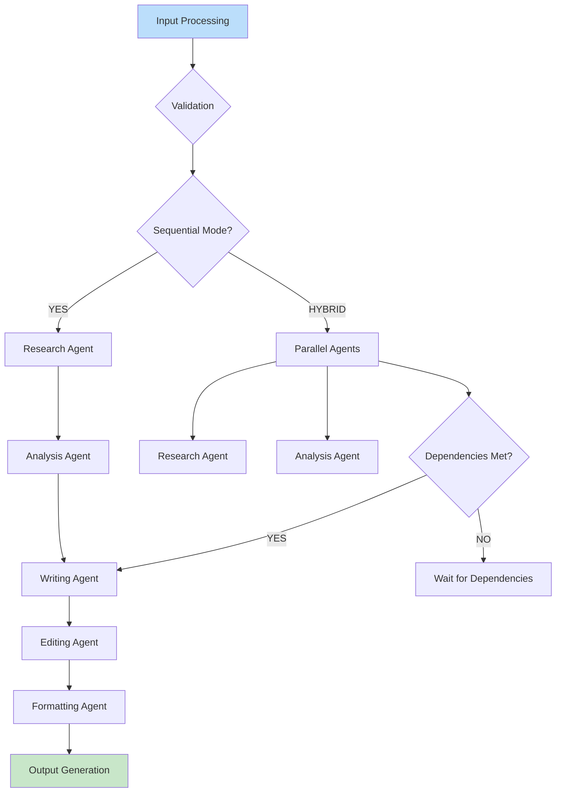
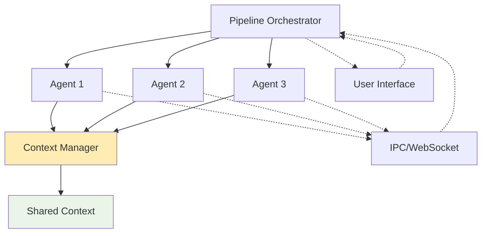
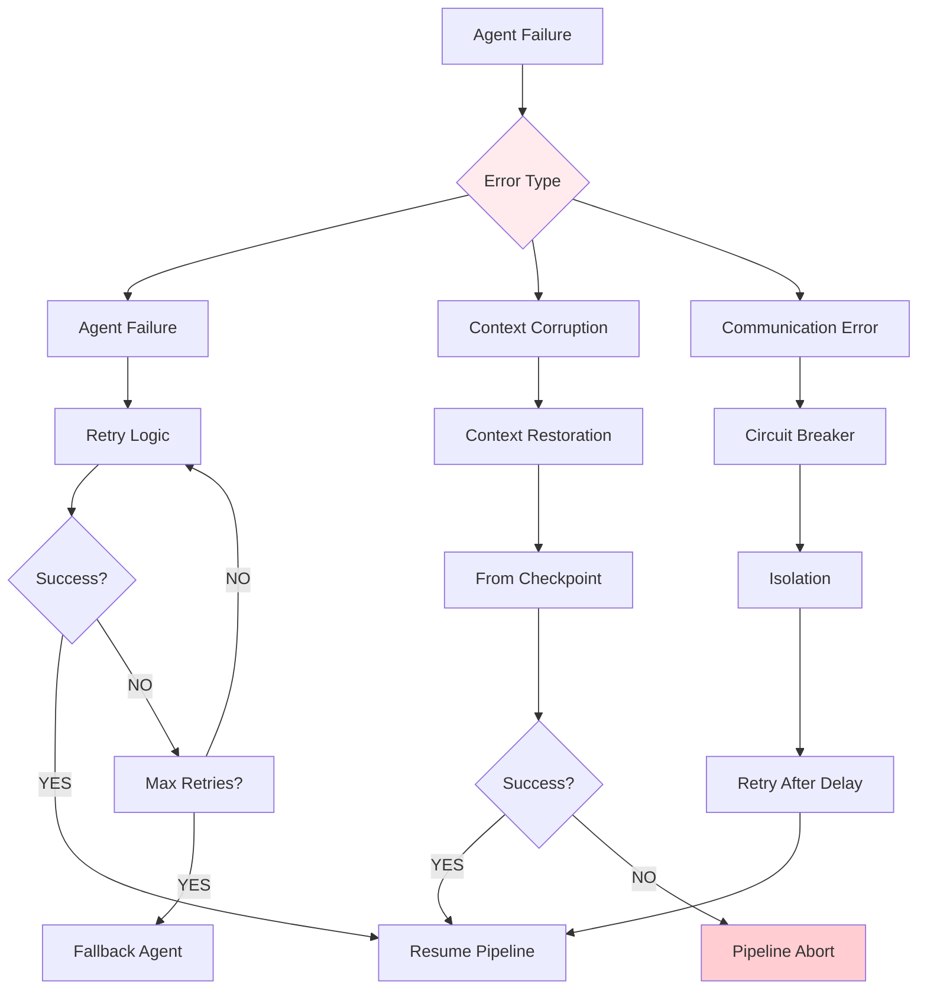

<!-- @format -->

# Multi-Agent Pipeline Core Architecture Specification

## Table of Contents

1. [Overview](#overview)
2. [Core Requirements](#core-requirements)
3. [Agent Architecture](#agent-architecture)
4. [Pipeline Orchestrator](#pipeline-orchestrator)
5. [Shared Context Management](#shared-context-management)
6. [Communication Protocol](#communication-protocol)
7. [Error Handling & Recovery](#error-handling--recovery)
8. [Integration Points](#integration-points)
9. [Extensibility Plan](#extensibility-plan)
10. [System Flow Diagrams](#system-flow-diagrams)

## Overview

This specification outlines the transformation of the Prompt Optimizer into a full content production system with a multi-agent pipeline architecture. The system will support sequential and parallel processing of video script writing tasks through specialized agents that collaborate via shared context.

### Project Context

- **Current State**: Single-purpose prompt optimization tool with existing vector search (Priority 1 complete)
- **Target Evolution**: Content production system with specialized agents
- **Architecture Constraint**: Zero-intrusion design maintained for all platforms (Web, Desktop, Browser Extension)
- **Integration Ready**: Prepared for Cohere Reranking (Priority 3) and LiteLLM Smart Routing (Priority 4)

### Key Architectural Principles

- **Modularity**: Clean separation between agents with well-defined interfaces
- **Extensibility**: Plugin-style agent addition and pipeline customization
- **Platform Agnostic**: Works across Electron IPC, Vercel serverless, and browser environments
- **Context Driven**: Shared memory system enables agent collaboration
- **Production Ready**: Comprehensive error handling and recovery mechanisms

## Core Requirements

### Agent-Based Processing

- **Sequential Agents**: Research → Analysis → Writing → Editing → Formatting
- **Parallel Support**: Concurrent agent execution where dependencies allow
- **Specialization**: Each agent has distinct capabilities and data sources

### Shared Context Management

- **Persistent Memory**: Context survives across agent handoffs
- **Structured Data**: Typed data interfaces for consistent information flow
- **Version Control**: Context versioning for rollback and comparison

### Platform Compatibility

- **Desktop IPC**: Full IPC communication via Electron proxy architecture
- **Web/Serverless**: Token-based real-time streaming via WebSockets or Server-Sent Events
- **Extension**: Service worker compatibility with background processing

### Performance Characteristics

- **Real-time Operation**: Sub-second response for agent communication
- **Scalable Processing**: Support for batch processing and multi-pipeline execution
- **Resource Efficient**: CPU/memory management for long-running pipelines

## Agent Architecture

### Core Agent Interface

```typescript
interface IAgent {
  id: string;
  name: string;
  description: string;
  capabilities: AgentCapability[];
  dependencies: AgentDependency[];

  // Core processing method
  process(ctx: AgentContext, input: AgentInput): Promise<AgentResult>;

  // Configuration and validation
  validateConfiguration(config: AgentConfig): ValidationResult;
  initialize(ctx: AgentContext): Promise<void>;
  cleanup(ctx: AgentContext): Promise<void>;

  // Metadata and introspection
  getMetadata(): AgentMetadata;
  getInputSchema(): SchemaDefinition;
  getOutputSchema(): SchemaDefinition;
}
```

### Specialized Agent Types

#### Researcher Agent

- **Purpose**: Contextual research and information gathering
- **Integrations**: Vector search (Chroma DB), web APIs, documentation sources
- **Output**: Structured research data, fact verification results
- **Primary Interface**: `IResearcherAgent extends IAgent`

#### Analysis Agent

- **Purpose**: Content analysis and insight generation
- **Capabilities**: Sentiment analysis, topic extraction, audience targeting
- **Input**: Research results from Researcher Agent
- **Output**: Analysis summaries, recommendation matrices
- **Primary Interface**: `IAnalysisAgent extends IAgent`

#### Writing Agent

- **Purpose**: Content generation and script writing
- **Capabilities**: Multi-language support, tone adaptation, structure templates
- **Input**: Research and analysis results
- **Output**: Draft content, script outlines, narrative structures
- **Primary Interface**: `IWritingAgent extends IAgent`

#### Editing Agent

- **Purpose**: Content refinement and quality improvement
- **Capabilities**: Grammar correction, style consistency, engagement optimization
- **Input**: Draft content from Writing Agent
- **Output**: Polished content with editorial changes tracked
- **Primary Interface**: `IEditingAgent extends IAgent`

#### Formatting Agent

- **Purpose**: Final output formatting for specific platforms
- **Capabilities**: HeyGen video script JSON, blog post HTML, custom formats
- **Input**: Edited content from Editing Agent
- **Output**: Platform-specific formatted output
- **Primary Interface**: `IFormattingAgent extends IAgent`

### Agent Capability Framework

```typescript
interface AgentCapability {
  type: CapabilityType;
  priority: number;
  configuration: Record<string, any>;
}

enum CapabilityType {
  VECTOR_SEARCH = "vector_search",
  TEXT_ANALYSIS = "text_analysis",
  CONTENT_GENERATION = "content_generation",
  FORMAT_CONVERSION = "format_conversion",
  LANGUAGE_PROCESSING = "language_processing",
}
```

## Pipeline Orchestrator

### Orchestrator Core Interface

```typescript
interface IPipelineOrchestrator {
  // Pipeline lifecycle management
  createPipeline(config: PipelineConfig): Promise<Pipeline>;
  executePipeline(
    pipeline: Pipeline,
    input: PipelineInput
  ): Promise<PipelineResult>;
  pausePipeline(pipelineId: string): Promise<boolean>;
  resumePipeline(pipelineId: string): Promise<boolean>;
  cancelPipeline(pipelineId: string): Promise<boolean>;

  // Monitoring and status
  getPipelineStatus(pipelineId: string): Promise<PipelineStatus>;
  getActivePipelines(): Promise<Pipeline[]>;
  getPipelineHistory(query: HistoryQuery): Promise<Pipeline[]>;
}
```

### Pipeline Configuration

```typescript
interface PipelineConfig {
  id: string;
  name: string;
  description: string;

  // Execution mode
  mode: PipelineMode; // SEQUENTIAL | PARALLEL | HYBRID

  // Agent definitions and connections
  agents: AgentDefinition[];
  connections: AgentConnection[];

  // Resource and timing constraints
  timeouts: TimeoutConfig;
  retries: RetryConfig;
  resourceLimits: ResourceLimits;

  // Callback and notification settings
  callbacks: CallbackConfig;
  notifications: NotificationConfig;
}
```

### Execution Engine

The orchestrator includes a sophisticated execution engine that:

1. **Dependency Resolution**: Automatically determines agent execution order
2. **Parallel Execution**: Parallelizes independent agents using worker pools
3. **State Management**: Tracks pipeline progress with checkpointing
4. **Resource Pooling**: Manages agent instances and computational resources
5. **Failure Recovery**: Implements intelligent retry and fallback strategies

## Shared Context Management

### Context Architecture

```typescript
interface IContextManager {
  // Context lifecycle
  createContext(
    pipelineId: string,
    metadata: ContextMetadata
  ): Promise<Context>;
  getContext(contextId: string): Promise<Context>;
  cloneContext(contextId: string): Promise<Context>;
  deleteContext(contextId: string): Promise<boolean>;

  // Data operations
  setData(
    contextId: string,
    key: string,
    data: any,
    schema?: SchemaDefinition
  ): Promise<boolean>;
  getData(contextId: string, key: string): Promise<any>;
  updateData(
    contextId: string,
    key: string,
    updater: DataUpdater
  ): Promise<boolean>;
  deleteData(contextId: string, key: string): Promise<boolean>;

  // Context sharing and versioning
  shareContext(contextId: string, targetPipeline: string): Promise<boolean>;
  createVersion(contextId: string): Promise<string>;
  revertToVersion(contextId: string, versionId: string): Promise<boolean>;

  // Cleanup and maintenance
  cleanupExpiredContexts(): Promise<number>;
  optimizeStorage(): Promise<OptimizationResult>;
}
```

### Context Data Structures

The context system supports:

- **Typed Schema Validation**: Ensures data consistency across agents
- **Hierarchical Organization**: Parent/child context relationships for complex pipelines
- **Persistent Storage**: Configurable storage backends (in-memory, Redis, IndexedDB)
- **Real-time Synchronization**: WebSocket-based updates for multi-platform support

### Context Flow Patterns

1. **Sequential Flow**: Context accumulates data as agents complete processing
2. **Branching Flow**: Context cloning for conditional logic and A/B testing
3. **Aggregation Flow**: Multiple agents contribute to the same context keys
4. **Streaming Flow**: Real-time context updates for progressive results

## Communication Protocol

### Message Protocol

```typescript
interface AgentMessage {
  id: string;
  timestamp: Date;
  sender: AgentId;
  recipient: AgentId;
  type: MessageType;
  payload: MessagePayload;
  metadata: MessageMetadata;
}

interface MessagePayload {
  contextId: string;
  action: AgentAction;
  data: any;
  correlationId?: string;
}

enum MessageType {
  REQUEST = "request",
  RESPONSE = "response",
  NOTIFICATION = "notification",
  ERROR = "error",
  HEARTBEAT = "heartbeat",
}
```

### Communication Patterns

1. **Request-Response**: Synchronous agent interactions within pipeline steps
2. **Publish-Subscribe**: Event-driven communication for status updates
3. **Streaming**: Real-time data streams for long-running operations
4. **Batch Processing**: Bulk message handling for high-throughput scenarios

### Communication Layer

The communication layer provides:

- **Transport Abstraction**: Support for IPC, HTTP, WebSocket, and queue-based transport
- **Message Routing**: Intelligent routing based on message type and agent capabilities
- **Load Balancing**: Distribution of messages across agent instances
- **Circuit Breaker**: Failure detection and automatic recovery mechanisms

## Error Handling & Recovery

### Error Classification

```typescript
enum ErrorType {
  AGENT_FAILURE = "agent_failure",
  CONTEXT_CORRUPTION = "context_corruption",
  COMMUNICATION_EXCEPTION = "communication_exception",
  TIMEOUT_EXCEEDED = "timeout_exceeded",
  RESOURCE_EXHAUSTED = "resource_exhausted",
  VALIDATION_ERROR = "validation_error",
}
```

### Recovery Strategies

1. **Retry Logic**: Configurable retry attempts with exponential backoff
2. **Fallback Agents**: Alternative agents for failed operations
3. **Context Recovery**: State restoration from checkpoints
4. **Circuit Breaker**: Automatic failure isolation and recovery
5. **Manual Intervention**: Administrative controls for manual recovery

### Monitoring & Alerting

- **Health Checks**: Automated agent and pipeline health monitoring
- **Performance Metrics**: Response times, success rates, resource usage
- **Error Tracking**: Comprehensive error logging and analysis
- **Alert Systems**: Configurable alerts for various failure scenarios

## Integration Points

### Vector Search Integration (Priority 1)

- **Seamless Access**: Researcher Agent integrates with existing Chroma DB service
- **Query Enhancement**: Ready for Cohere Reranking (Priority 3)
- **Flexible Queries**: Semantic search with metadata filtering

### LiteLLM Integration (Priority 4)

- **Smart Routing**: Different models for different agent roles
- **Cost Optimization**: Research agents use cheaper models, writing agents use premium models
- **Fallback Handling**: Automatic fallback to alternative models on failures

### Platform-Specific Integrations

#### Electron IPC Integration

```typescript
interface ElectronAgentProxy {
  invokePipeline(pipelineConfig: PipelineConfig): Promise<PipelineResult>;
  subscribeToUpdates(pipelineId: string): EventEmitter;
  cancelPipeline(pipelineId: string): Promise<boolean>;
}
```

#### Vercel Serverless Integration

- **Serverless Functions**: Pipeline execution via Vercel Functions
- **Real-time Updates**: WebSocket support for streaming responses
- **API Routes**: RESTful endpoints for pipeline management

#### Browser Extension Integration

- **Background Processing**: Service worker-based agent execution
- **Cross-Origin Handling**: Content Script to Background communication
- **Storage Integration**: Chrome storage API for context persistence

## Extensibility Plan

### Agent Registration Framework

```typescript
interface AgentRegistry {
  registerAgent(agent: IAgent): Promise<boolean>;
  unregisterAgent(agentId: string): Promise<boolean>;
  getAvailableAgents(): Promise<IAgent[]>;
  getAgentsByCapability(capability: CapabilityType): Promise<IAgent[]>;
}
```

### Plugin System

- **Agent Plugins**: Modular agent implementations
- **Pipeline Templates**: Pre-configured pipeline definitions
- **Custom Connectors**: Integration points for external services
- **Extension Points**: Hooks for customization and extensions

### Pipeline Customization

- **Conditional Logic**: If-then-else branches in pipeline execution
- **Dynamic Agent Selection**: Runtime agent selection based on context
- **Parameter Overrides**: Pipeline-specific agent configuration
- **Custom Stages**: User-defined processing stages

### Future Expansion

- **Machine Learning Integration**: ML-optimized agents
- **Distributed Processing**: Multi-node pipeline execution
- **Real-time Collaboration**: Multi-user pipeline editing
- **Marketplace Integration**: Community agent marketplace

## System Flow Diagrams

### Core Pipeline Flow



### Agent Communication Flow



### Error Recovery Flow



This architecture specification provides a comprehensive framework for implementing the multi-agent pipeline system while maintaining compatibility with the existing Prompt Optimizer architecture and preparing for future integrations.
